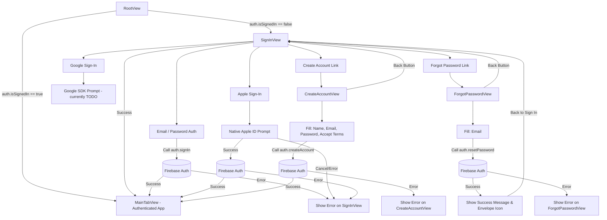

# Orbit - Authentication Information Architecture

Here is the map of the screens related to Authentication and how a user transitions between them.

## Edge Cases Covered & Needed

1. **Incorrect Password or Email Formulation**: Handled. `SignInView` shows an error banner natively rendered through `$auth.errorMessage`, updating automatically on state change.
2. **Password complexity (< 6 characters) on Registration**: Handled. Submit button is disabled (`canSubmit` property in `CreateAccountView`). Firebase error is also caught if bypassed.
3. **User cancels Apple Sign In**: Handled. The Apple Sign-In helper (`AuthManager.swift`) explicitly checks for `ASAuthorizationError.canceled` and does not display an error banner to the user (since it's a manual exit, not an unexpected failure).
4. **Resend Reset Email**: Handled. In the `ForgotPasswordView`, after submitting an email once, the view shifts to a success state with a "Resend email" button to try again from the same screen.

## To-Do / Needs Implementation

1. **Google Sign-In**: The `GoogleAuth` flow strictly has UI `GoogleLogo` but triggers a `// TODO: wire Google Sign-In after SDK added` comment. Needs SDK installation and wiring into `AuthManager`.
2. **Terms of Service & Privacy Policy Links**: The checkbox in `CreateAccountView` exists for agreement, but the text is static. They need interactive hyperlinks pointing to an actual ToS/Privacy web page or modal view.
